# 🎓 NKUST 智慧課表管理系統 (Course Schedule Manager)


這是一個基於 **Flutter** 開發的跨平台課表管理應用程式。專為大學生設計，整合了 **雲端身分驗證**、**本地離線資料庫** 以及 **GPA 成績視覺化分析** 功能。
採用 **Local-First (本地優先)** 架構，確保在無網路環境下也能流暢查看課表，並支援多帳號登入與個人化設定。

## ✨ 核心功能 (Features)

* **🔐 會員系統**：
    * 整合 Firebase Authentication (Email/Password)。
    * 支援註冊、登入、登出及「忘記密碼」信件發送功能。
    * 多帳號隔離：不同使用者的課表與設定完全獨立。
* **📅 智慧課表**：
    * 視覺化週課表介面，支援點擊查看課程詳情（教室、教師）。
    * CRUD 操作：新增、修改、刪除課程。
    * **智慧防呆**：自動檢測衝堂、學期自動補齊邏輯。
* **📊 學習成效分析**：
    * 內建 **NTU 4.3 GPA** 計算引擎。
    * 提供歷年 GPA 與平均分數的 **折線圖趨勢分析**。
    * 自動過濾未填成績或不及格之學分計算。
* **⚙️ 高度個人化**：
    * **深色模式 (Dark Mode)**：支援系統跟隨或手動切換。
    * **自訂節次**：可調整最大顯示節次 (10~15節)。
    * **自訂時間**：可設定日/夜間部第一節課的開始時間。

## 🛠️ 技術架構 (Tech Stack)

* **Frontend Framework**: [Flutter](https://flutter.dev/) (Dart)
* **State Management**: [Provider](https://pub.dev/packages/provider)
* **Local Database**: [Isar](https://isar.dev/) (NoSQL, High performance)
* **Authentication**: [Firebase Auth](https://firebase.google.com/docs/auth)
* **Charts**: [fl_chart](https://pub.dev/packages/fl_chart)
* **Architecture**: Layered Architecture (Presentation, State, Data, Infrastructure)

### 系統架構圖

```mermaid
graph LR
    User -- Flutter App --> App
    App -- 驗證 --> Firebase
    App -- CRUD --> IsarDB[(Local DB)]

```


## 🚀 如何執行 (Installation)

如果你想在本地端執行此專案，請按照以下步驟操作：

1. **Clone 專案**
```bash
git clone [https://github.com/你的帳號/你的專案名稱.git](https://github.com/你的帳號/你的專案名稱.git)
cd 你的專案名稱


2. **安裝依賴套件**
```bash
flutter pub get

```


3. **生成 Isar 資料庫代碼** (重要！)
```bash
dart run build_runner build --delete-conflicting-outputs

```


4. **設定 Firebase**
* 請自行建立 Firebase 專案。
* 使用 `flutterfire configure` 綁定你的專案。


5. **執行 App**
```bash
flutter run
```
